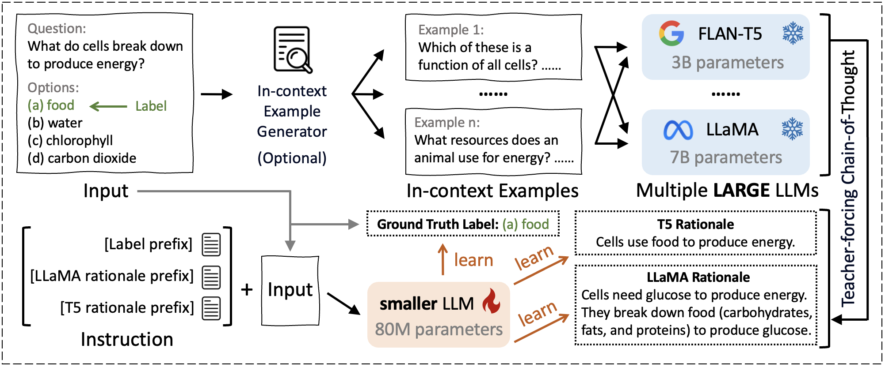

# Beyond Answers: Transferring Reasoning Capabilities to Smaller LLMs Using Multi-Teacher Knowledge Distillation
This repo contains an official PyTorch implementation of our paper: Beyond Answers: Transferring Reasoning Capabilities to Smaller LLMs Using Multi-Teacher Knowledge Distillation



## 1 Environment Setup

```
conda create --name tinyllm python=3.9 -y
conda activate tinyllm
conda install --file requirements.txt
```

## 2 Quick Start

### 2.1 Obtaining Rationales

The following template should be provided as input to facilitate the teacher model generate rationales.

> Question:
>
> The sun is responsible for
>
> Options:
>
> (a) puppies learning new tricks
>
> (b) children growing up and getting old
>
> (c) flowers wilting in a vase
>
> (d) plants sprouting, blooming and wilting
>
> Answer:
>
> d
>
> Rationale:
>
> Let's think step by step.

With the teacher-forcing strategy, we add two randomly selected **in-context examples** of the same dataset to the input so the teacher model can generate a more accurate rationale.


### 2.2 JSON Files Generation

If you want to use multiple teachers, you can mimic the JSON format of the path `datasets/piqa/llm` to generate your own file, which will be explained in detail below using the third line in `train_CoT_0.json` as an example.

> "Welding is the process of joining metals together. To permanently attach metal legs to a chair, you can Weld the metal together to get it to stay firmly in place. Thus, the answer is (a) Weld the metal together to get it to stay firmly in place\n\nQ: To permanently attach metal legs to a chair, you can\nAnswer Choices:\n(a) Weld the metal together to get it to stay firmly in place\n(b) Nail the metal together to get it to stay firmly in place llama rationale: Let's think step by step.\nFirst, the metal legs must be firmly attached to the chair.\nSecond, the metal legs must be firmly attached to each other.\nWe can attach the metal legs to each other by nailing them together.\nWe can attach the metal legs to the chair by welding them to the chair.\nTherefore, we need to nail the metal legs together.\nExplanation:\na) We can attach the metal legs to each other by nail"

| Type              | Corresponding text                                           |
| ----------------- | ------------------------------------------------------------ |
| Question          | To permanently attach metal legs to a chair, you can         |
| Choices           | (a) Weld the metal together to get it to stay firmly in place\n(b) Nail the metal together to get it to stay firmly in place |
| Answer            | (a)                                                          |
| Flan-T5 rationale | Welding is the process of joining metals together. To permanently attach metal legs to a chair, you can Weld the metal together to get it to stay firmly in place. |
| LLaMA-2 rationale | First, the metal legs must be firmly attached to the chair.\nSecond, the metal legs must be firmly attached to each other.\nWe can attach the metal legs to each other by nailing them together.\nWe can attach the metal legs to the chair by welding them to the chair.\nTherefore, we need to nail the metal legs together.\nExplanation:\na) We can attach the metal legs to each other by nail |

### 2.3 Learning from Multiple LLMs

#### Arguments

- `--from_pretrained`: `google/flan-t5-large`, `google/flan-t5-base`, `google/flan-t5-small`
- `--dataset`: `obqa`, `arc`, `piqa`, `riddle`, `pubmedqa`, `bioasq`
- `--gamma`: Ground-truth label weight for multi-task training
- `--alpha`: FLAN-T5 rationale weight for multi-task training
- `--beta`: LLaMA-2 rationale weight for multi-task training
- `--batch_size`: Batch size
- `--eval_steps`: How many steps to evaluate the model during training
- `--max_steps`: Maximum steps for training

#### Examples

+ TinyLLM

````
python tiny.py --from_pretrained google/flan-t5-large --dataset piqa --max_steps 16113 --alpha 2 --beta 2
````

## 3 Datasets Links

[OpenBookQA Dataset](https://allenai.org/data/open-book-qa)

[AI2 Reasoning Challenge (ARC) 2018](https://allenai.org/data/arc)

[PIQA (Physical Interaction: Question Answering)](https://yonatanbisk.com/piqa/)

[RiddleSense: Reasoning about Riddle Questions Featuring Linguistic Creativity and Commonsense Knowledge](https://inklab.usc.edu/RiddleSense/)

[PubMedQA](https://pubmedqa.github.io/)

[BioASQ (Biomedical Semantic Indexing and Question Answering)](http://participants-area.bioasq.org/datasets/)

## 4 Checkpoints Links

You can access the fine-tuned checkpoints for each dataset on Hugging Face:

- [OpenBookQA Checkpoint](https://huggingface.co/Eclipse42/TinyLLM-OpenBookQA)
- [ARC Checkpoint](https://huggingface.co/Eclipse42/TinyLLM-arc)
- [PIQA Checkpoint](https://huggingface.co/Eclipse42/TinyLLM-piqa)
- [RiddleSense Checkpoint](https://huggingface.co/Eclipse42/TinyLLM-riddle)
- [PubMedQA Checkpoint](https://huggingface.co/Eclipse42/TinyLLM-pubmedqa)
- [BioASQ Checkpoint](https://huggingface.co/Eclipse42/TinyLLM-bioasq)
